<div align="center">



<br/>

<a href="https://github.com/Rahul139-creater">
  
</a>

<br/><br/>

<a href="https://www.linkedin.com/in/rahul-sharma-27aa5a331/"></a>
<a href="https://github.com/Rahul139-creater"></a>
<a href="mailto:your.email@example.com"></a>

<br/><br/>


</div>

<br/>

## 🧭 About Me

<table>
<tr>
<td width="55%" valign="top">

I'm a **Full Stack Developer** who enjoys turning ideas into fast, clean, and scalable web applications. I work end-to-end — from designing responsive interfaces to building solid backend APIs and structuring databases.

```yaml
name: Rahul Sharma
role: Full Stack Developer
stack: [React, Node.js, Express, MongoDB, MySQL]
languages: [JavaScript, Python, Java, C, C++]
currently_exploring: DSA & System Design
looking_for: Collaborations · Internships · Full-time roles
```

- 🔭 Building projects with the **MERN stack**
- ⚙️ Comfortable across frontend, backend & databases
- 🎯 Focused on writing clean, maintainable code
- 🌱 Sharpening **DSA** and **system design** fundamentals
- 💬 Ask me about React, Node.js, or Python

</td>
<td width="45%" valign="top" align="center">



</td>
</tr>
</table>

<br/>

## 🧰 Tech Stack

<div align="center">

**Frontend**
<br/>


**Backend & Databases**
<br/>


**Languages**
<br/>


**Tools**
<br/>


</div>

<br/>

## 📊 GitHub Insights

<div align="center">


<br/>


<br/>


</div>

<br/>

## 🚀 Featured Projects

<table width="100%">
<tr>
<td width="50%" valign="top">

<h3>🌦️ Weather Application</h3>

Real-time weather forecasting app that pulls live data from a weather API and renders it in a clean, responsive interface.


<br/><br/>


<br/><br/>

**[→ View Repository](https://github.com/Rahul139-creater/WeatherApplication)**

</td>
<td width="50%" valign="top">

<h3>🎓 Geeta University Website</h3>

A university website project built with a focus on structured content presentation and clean, responsive front-end implementation.


<br/><br/>


<br/><br/>

**[→ View Repository](https://github.com/Rahul139-creater/Geetauniversity)**

</td>
</tr>
</table>

<p align="center"><i>More projects on my <a href="https://github.com/Rahul139-creater?tab=repositories">GitHub repositories →</a></i></p>

<br/>

## 🤝 Let's Build Something Together

<div align="center">

I'm always open to interesting projects, collaborations, or a good tech conversation.
<br/>
Reach out — I usually reply fast.

<br/><br/>

<a href="https://www.linkedin.com/in/rahul-sharma-27aa5a331/"></a>

</div>

---

<sub>Thanks for stopping by — let's build something great. ✨</sub>

</div>
